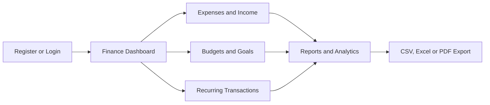

<div align="center">

  

  # FinanceHub

  ### Personal Finance Management System

  Track expenses, manage budgets, monitor income and build better financial habits—all from one secure dashboard.

  <p>
    
    
    
    
    
  </p>

  <p>
    <a href="#-features">Features</a> •
    <a href="#-screenshots">Screenshots</a> •
    <a href="#-installation">Installation</a> •
    <a href="#-how-to-use">How to Use</a> •
    <a href="#-project-structure">Structure</a>
  </p>

</div>

---

## About the Project

**FinanceHub** is a full-stack personal finance web application designed to help users understand and control their money. It combines day-to-day expense tracking with budgets, income, savings goals, recurring transactions, reports and export tools.

The application uses **Python and Flask** for the backend, **SQLite** for persistent storage, **Jinja** for server-rendered pages, **Tailwind CSS** for the responsive interface and **Chart.js** for financial visualisations. All monetary values are displayed in **Indian Rupees (₹)**.

FinanceHub is suitable as a portfolio project, college project or foundation for a production-ready personal finance platform.

##  Features

###  Authentication and Privacy

- Secure user registration and login
- Password hashing instead of plain-text password storage
- User-specific financial records
- Private receipt access restricted to the owning user
- Protected routes for authenticated users

###  Expense Management

- Add, edit and delete expenses
- Record description, amount, category, date and optional notes
- Choose a payment method: **Cash, PhonePe/UPI, Card or Bank Transfer**
- Upload receipt images or PDF documents
- Search and filter expenses by date, category, payment method and amount
- Navigate between previous and next months from the dashboard

###  Income and Balance

- Record and manage income sources
- Compare total income against total spending
- Automatically calculate the currently available balance
- Include income in financial reports and recurring entries

###  Budgets and Alerts

- Create monthly category budget limits
- View visual progress bars for budget usage
- Receive a warning after reaching **80%** of a budget
- Clearly identify categories that have exceeded their limits

###  Savings Goals

- Create goals with target amounts
- Add contributions over time
- Track completion using progress indicators
- Monitor the remaining amount for every goal

###  Recurring Transactions

- Schedule recurring expenses or income
- Supported frequencies: **weekly, monthly and yearly**
- Reduce repeated manual data entry
- Keep predictable bills and income organised

###  Reports and Analytics

- Generate reports for a selected date range
- Analyse spending by category and payment method
- View daily, monthly and yearly trends
- Visualise information with Chart.js charts
- Review payment-method analytics
- Export records as **CSV, Excel or PDF**

###  Reliable Data Handling

- Lightweight SQLite database
- Automatic database migrations
- Existing users and transactions are preserved when new fields are introduced
- Uploaded receipts are validated by type and size

##  Screenshots

### Dashboard

<p align="center">
  
</p>

<p align="center"><i>Monthly financial overview with income, expenses, available balance, budgets, charts, recent transactions and savings goals.</i></p>

### Add More Screenshots (Optional)

The banner and dashboard screenshot are already included in this package. To display more application screens on GitHub, use this folder inside your repository:

```text
assets/screenshots/
```

Add your screenshots using these filenames:

```text
assets/screenshots/add-expense.png
assets/screenshots/reports.png
assets/screenshots/budgets-goals.png
```

Then remove the `<!--` and `-->` lines around the block below:

<!--
<table>
  <tr>
    <td width="33%"></td>
    <td width="33%"></td>
    <td width="33%"></td>
  </tr>
  <tr>
    <td align="center"><b>Expense entry</b></td>
    <td align="center"><b>Reports and analytics</b></td>
    <td align="center"><b>Budgets and goals</b></td>
  </tr>
</table>
-->

> Tip: Capture screenshots at the same size for a clean and professional GitHub layout. Do not include real financial or personal information in public screenshots.

##  Technology Stack

| Layer | Technology | Purpose |
|---|---|---|
| Backend | Python, Flask | Routing, authentication, validation and application logic |
| Templates | Jinja | Dynamic server-rendered HTML pages |
| Frontend | HTML, Tailwind CSS | Responsive user interface and styling |
| Charts | Chart.js | Financial graphs and analytics |
| Database | SQLite | Users, expenses, income, budgets, goals and recurring records |
| Security | Flask sessions, password hashing | Authentication and protected user data |
| Export | CSV, Excel and PDF tools | Downloadable financial reports |

## Application Workflow



## Project Structure

```text
expense-tracker/
├── app.py
├── expenses.db
├── requirements.txt
├── static/
│   └── uploads/
└── templates/
    ├── base.html
    ├── dashboard.html
    ├── expenses.html
    ├── add_expense.html
    ├── edit_expense.html
    ├── income.html
    ├── budgets.html
    ├── goals.html
    ├── recurring.html
    ├── reports.html
    ├── login.html
    └── register.html
```

##  Prerequisites

Before running FinanceHub, install:

- **Python 3.10 or newer**
- **pip**, included with most Python installations
- A modern browser such as Chrome, Edge, Firefox or Safari
- Git, if you want to clone the repository

Check your Python installation:

```powershell
python --version
python -m pip --version
```

##  Installation

### 1. Clone the repository

```powershell
git clone https://github.com/sibasundarsahoo08-creator/FinanceHub-Expense-Tracker.git
cd FinanceHub-Expense-Tracker\expense-tracker
```

Replace 'sibasundarsahoo08-creator' with your GitHub username.

### 2. Create a virtual environment

```powershell
python -m venv .venv
```

Activate it in PowerShell:

```powershell
Set-ExecutionPolicy -Scope Process -ExecutionPolicy Bypass
.\.venv\Scripts\Activate.ps1
```

### 3. Install the dependencies

```powershell
python -m pip install --upgrade pip
python -m pip install -r requirements.txt
```

### 4. Start FinanceHub

```powershell
python app.py
```

Open the following address in your browser:

```text
http://127.0.0.1:5000
```

The application creates or upgrades its database automatically while preserving existing records.

## How to Use

1. Create an account and sign in.
2. Add your income sources.
3. Add expenses and select the relevant category and payment method.
4. Set monthly budgets for important spending categories.
5. Create savings goals and record contributions.
6. Add recurring bills or regular income.
7. Use the dashboard arrows to review different months.
8. Open Reports to inspect charts and export your data.

##  Use on Android or iPhone

FinanceHub can be used from a mobile browser after it is deployed to a public HTTPS address.

### iPhone

1. Open the deployed FinanceHub link in Safari.
2. Tap **Share**.
3. Choose **Add to Home Screen**.
4. Tap **Add**.

### Android

1. Open the deployed link in Chrome.
2. Open the browser menu.
3. Choose **Add to Home screen** or **Install app**.

> `http://127.0.0.1:5000` is a local development address and is not accessible from another device unless networking is configured. A hosted HTTPS URL is required for normal remote access.

##  Receipt Upload Rules

FinanceHub accepts receipt files with these restrictions:

- Supported images: **PNG, JPG/JPEG and WEBP**
- Supported documents: **PDF**
- Maximum file size: **5 MB**
- Receipt files are served only to the user who owns the related transaction

For public repositories, keep actual uploaded receipts out of Git by adding the upload directory contents to `.gitignore` while keeping an empty placeholder such as `.gitkeep`.

##  Security Notes

- Never commit production secrets, passwords or private receipts to GitHub.
- Use a strong random Flask secret key in production.
- Disable Flask debug mode before public deployment.
- Serve the deployed application over HTTPS.
- Back up the SQLite database before major upgrades.
- For a larger multi-user deployment, consider migrating from SQLite to PostgreSQL.

## Troubleshooting

### `python` is not recognised

Reinstall Python and enable **Add Python to PATH**, or try:

```powershell
py app.py
```

### A package is missing

Run:

```powershell
python -m pip install -r requirements.txt
```

### Port 5000 is already in use

Close the older Flask terminal or change the application port before starting it again.

### PowerShell blocks virtual-environment activation

Run:

```powershell
Set-ExecutionPolicy -Scope Process -ExecutionPolicy Bypass
```

Then activate `.venv` again.

## Possible Future Improvements

- Progressive Web App support with offline caching
- Email verification and password recovery
- Two-factor authentication
- Bank statement import and automatic categorisation
- Smart spending insights and anomaly detection
- PostgreSQL support for scalable deployment
- Automated tests and continuous integration
- Optional cloud backup and multi-device synchronisation

## Contributing

Contributions and suggestions are welcome.

1. Fork the repository.
2. Create a feature branch: `git checkout -b feature/my-feature`.
3. Commit your changes: `git commit -m "Add my feature"`.
4. Push the branch: `git push origin feature/my-feature`.
5. Open a pull request.

## Author

Developed by **Siba Sundar Sahoo**.

- GitHub: https://github.com/sibasundarsahoo08-creator

If you find FinanceHub useful, consider giving the repository a ⭐.

